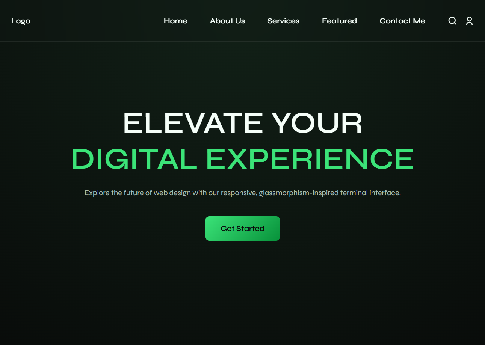

# Responsive Navbar with Search and Login

A modern, professional, and fully responsive navigation bar featuring integrated search and login modals. Built with HTML, SCSS/CSS, and Vanilla JavaScript.



## 🚀 Features

- **Dark Terminal Theme:** Sleek dark gradient background with high-contrast typography.
- **Glassmorphism Navbar:** Modern "glass" effect with background blur and subtle borders.
- **Fully Responsive:** Optimized for mobile, tablet, and desktop views.
- **Search Modal:** Interactive search overlay for quick access.
- **Login Modal:** Sleek login interface for user authentication.

## 🛠️ Built With

- **HTML5:** Semantic structure.
- **SCSS/CSS:** Custom styling with CSS variables and responsive design.
- **JavaScript:** Interactive components for menu, search, and login toggles.
- **Remix Icon:** High-quality icon library.

## 📂 Project Structure

```text
Responsive_Navbar_Design/
├── assets/
│   ├── css/        # Compiled CSS
│   ├── img/        # Project images
│   ├── js/         # JavaScript logic
│   └── scss/       # Modular SCSS files (base, components, config, layout)
├── index.html      # Main entry point
└── LICENSE         # MIT License
```

## ⚙️ Installation & Usage

1. **Clone the repository:**
   ```bash
   git clone https://github.com/rajjitlai/Responsive_Navbar_Design.git
   ```
2. **Open the project:**
   Simply open `index.html` in your preferred web browser.

## 🔗 Repository

Find the source code here: [https://github.com/rajjitlai/Responsive_Navbar_Design](https://github.com/rajjitlai/Responsive_Navbar_Design)

## 📄 License

This project is licensed under the MIT License - see the [LICENSE](LICENSE) file for details.

---
Developed by **Rajjit Laishram**
